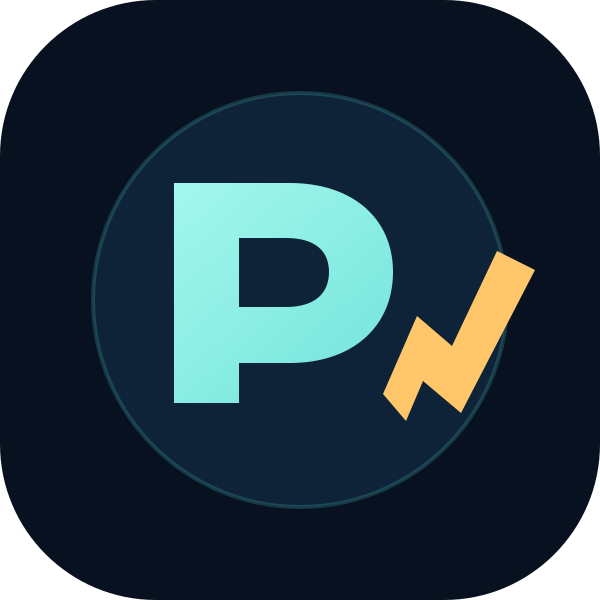
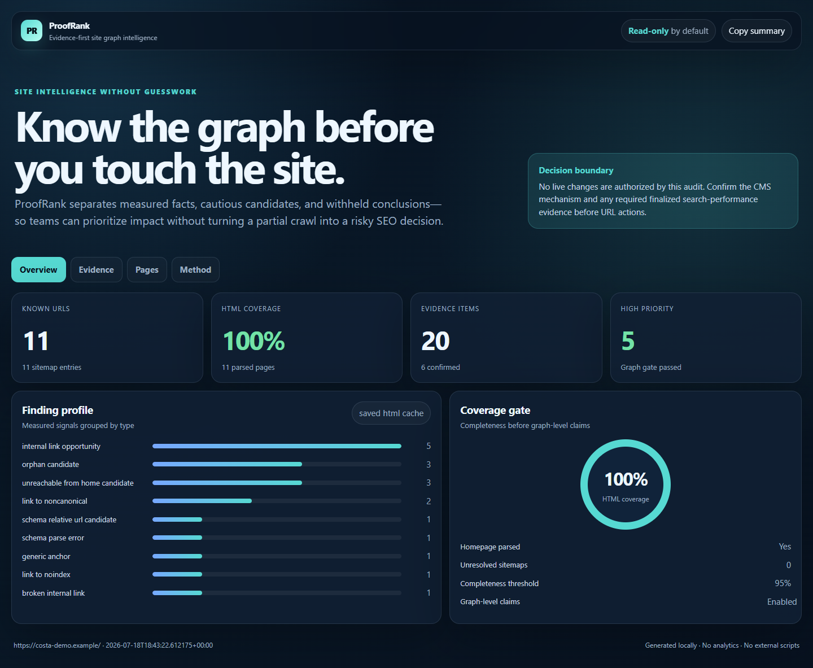

<p align="center"></p>

# ProofRank

**Evidence-first site graph intelligence for Codex.**

[Open the bundled interactive demo](showcase/proofrank-demo.html)



ProofRank turns URL inventories, saved sitemaps, and saved HTML caches into a reproducible graph audit. It separates directly observed facts, cautious candidates, and conclusions that the available coverage cannot support.

The result is not another generic SEO content generator. It is a safety layer for deciding what a team should investigate before touching a live site.

## What it detects

- crawl and sitemap coverage;
- internal links and click depth;
- orphan and unreachable-page candidates;
- broken, noindex, and noncanonical internal-link targets;
- JSON-LD syntax and visible-content mismatches;
- exact and near-duplicate content candidates;
- cautious title/H1/query overlap candidates;
- contextual internal-link opportunities.

## Architecture

ProofRank combines three layers:

1. **Deterministic Python engine** for normalization, parsing, graph construction, evidence labels, and portable JSON/CSV/Markdown outputs.
2. **Codex Skill** for safe input selection, completeness gates, interpretation, and action boundaries.
3. **Dependency-free dashboard** for fast human review without uploading audit data to a third party.

No API key or third-party Python package is required for the bundled demo.

## Run the synthetic demo

From the repository root:

```bash
python plugins/proofrank/skills/audit-site-graph/scripts/run_demo.py
```

Open:

```text
plugins/proofrank/demo-output/dashboard.html
```

The fixture is fully synthetic and intentionally contains broken links, a noindex target, a noncanonical URL, an orphan candidate, malformed JSON-LD, and duplicate content.

## Run on saved site data

```bash
python plugins/proofrank/skills/audit-site-graph/scripts/site_graph_audit.py \
  --site "https://example.com/" \
  --inventory "inventory.csv" \
  --page-cache "page_cache.json" \
  --sitemap "sitemap.xml" \
  --brand-term "Example" \
  --output-dir "out"

python plugins/proofrank/skills/audit-site-graph/scripts/render_dashboard.py \
  --audit "out/audit.json" \
  --output "out/dashboard.html"
```

See the bundled Skill references for accepted input shapes and evidence rules.

## Install as a Codex plugin

For local testing, add this repository as a marketplace source:

```bash
codex plugin marketplace add /absolute/path/to/proofrank
```

After the GitHub repository is published, the equivalent command is:

```bash
codex plugin marketplace add OWNER/REPOSITORY
codex plugin add proofrank@proofrank-marketplace
```

Then open the Plugins Directory in the ChatGPT desktop app or `/plugins` in Codex CLI, install **ProofRank**, and start a new task. Invoke the bundled skill explicitly with `$audit-site-graph` or describe the desired read-only site audit.

## Safety model

- Local reads and local report writes by default.
- Network crawling requires both `--crawl` and `--allow-network`.
- Live crawling still requires explicit scope approval.
- No CMS, hosting, analytics, Search Console, sitemap, redirect, canonical, or content writes.
- No URL deletion, merge, redirect, or noindex recommendation from similarity alone.
- The static dashboard embeds only sanitized audit results, not local input paths.

## Verify

```bash
python scripts/verify.py
```

The verification runs unit tests, generates the demo in a temporary folder, validates the public dashboard boundary, checks the manifest shape, and scans for common secret formats.

## OpenAI Build Week 2026

ProofRank was generalized and packaged during the OpenAI Build Week submission period using Codex and GPT-5.6. The project demonstrates how an agent can combine deterministic tools, explicit uncertainty, and a coherent user experience on a real operational problem.

**Track:** Work and productivity.

The public repository contains only synthetic demo data. The private real-world case study used a multilingual travel portal with more than 3,000 normalized URLs; private credentials, analytics exports, backups, and customer data are excluded.

See [BEFORE_AFTER.md](BEFORE_AFTER.md) for the boundary between prior domain-specific work and the Build Week extension.

Submission materials: [Devpost draft](docs/DEVPOST_SUBMISSION.md) · [under-three-minute demo script](docs/DEMO_SCRIPT.md) · [judge testing guide](docs/JUDGES.md).

## License

MIT © 2026 Andrei Zakharov.
